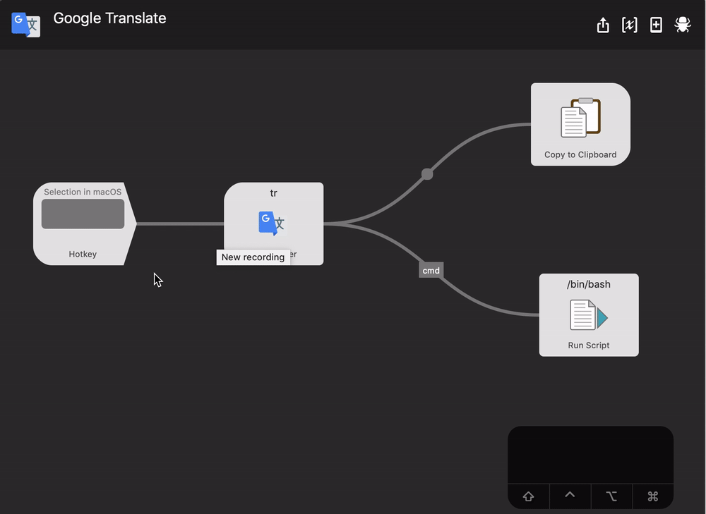
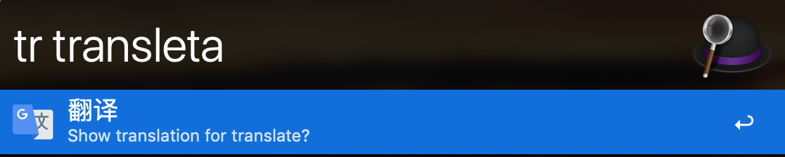
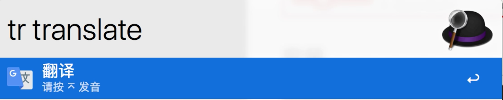
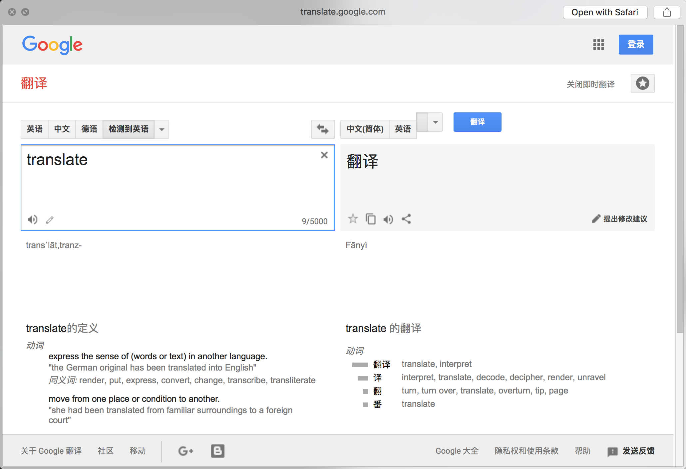

# alfred-google-translate

## 安装

*Requires [Node.js](https://nodejs.org) 4+ and the Alfred [Powerpack](https://www.alfredapp.com/powerpack/).*

- npm安装`npm install -g alfred-google-translate`
- [下载](https://github.com/xfslove/alfred-google-translate/releases/tag/v1.1.3) workflow
- [更新日志](https://github.com/xfslove/alfred-google-translate/releases)

## 用法

在Alfred中, 输入`tr`, 和想要翻译的关键字, 会查询出关键字的翻译结果和相关（同义）的结果.

其中第一项为查询关键字本身，第二项为查询关键字的翻译结果，并带上音标（韦氏音标）.

第三项开始为查询关键字的相关（同义）翻译结果.

第一项和第二项：

选中其中一个, 按<kbd>enter</kbd>复制翻译结果到剪切板.

按住<kbd>cmd</kbd>再按<kbd>enter</kbd>发音.

按<kbd>shift</kbd>显示当前项在google翻译官网翻译内容.

按住<kbd>cmd</kbd>+<kbd>L</kbd>显示完整的当前项的翻译.

第三项以后，按<kbd>enter</kbd>会用当前项查询.

如果输入关键字错误, 会有纠错提示, 按<kbd>enter</kbd>会用纠错后的关键字查询.

## 设置快捷键

设置快捷键后，按快捷键可以快速激发workflow，并且会带着按键时选中的字符串.

如果是直接安装的workflow，可能快捷键没有设置，可以手动进行设置，设置过程如图: 

使用方法如图:

## 注意

最新版本已经不需要代理了，非常感谢 [@lingyv](https://github.com/lingyv) 的`pull request`.

不需要代理的原理是使用`translate.google.cn`代替了`translate.google.com`，如遇到无法拉取翻译结果的情况，可以考虑更换`DNS`设置。比如更换为`DNSPod`或者`Alibaba`的公共dns。

~~由于使用的是google的翻译接口, 在大陆需要**才能使用, 需要电脑上有http代理,~~
~~然后在该workflow中添加如下两个环境变量~~

## 效果

- 纠错:

  

- 按<kbd>enter</kbd>复制结果:

    
- 按<kbd>cmd</kbd>+<kbd>enter</kbd>发音:

    
- 按<kbd>shift</kbd>打开页面展示详情:

    

## Related

- [alfy](https://github.com/sindresorhus/alfy) - Create Alfred workflows with ease
- [google-translate-api](https://github.com/vitalets/google-translate-api) - A free and unlimited API for Google Translate

## License

MIT © 
