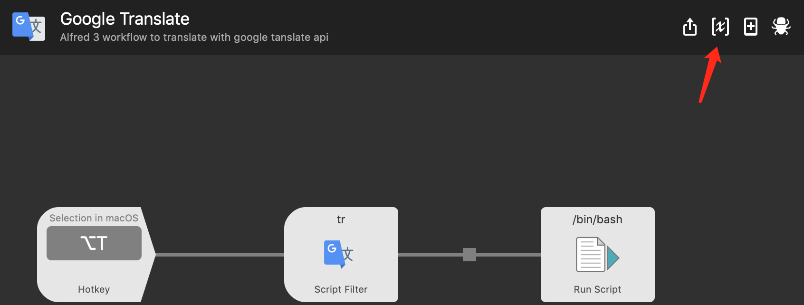
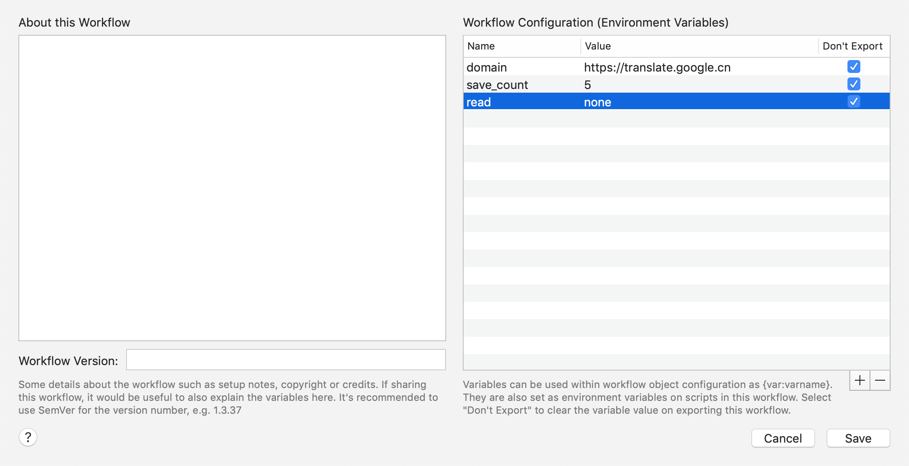
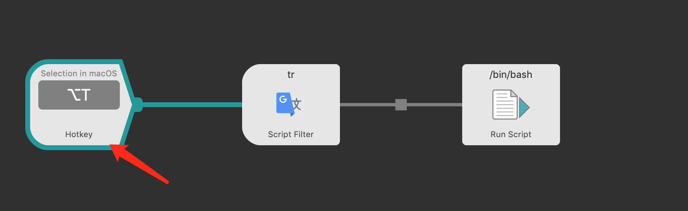
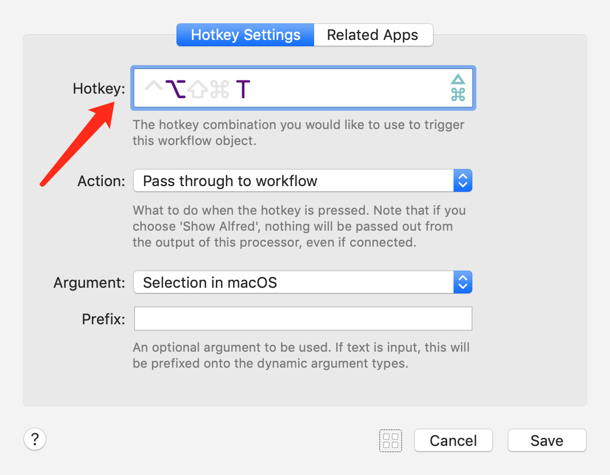

# alfred-google-translate

## Install

*Requires [Node.js](https://nodejs.org) 4+ and the Alfred [Powerpack](https://www.alfredapp.com/powerpack/).*

- install with `npm install -g alfred-google-translate`
- or [download](https://github.com/xfslove/alfred-google-translate/releases/tag/v2.0.4) workflow

## [Changelog](https://github.com/xfslove/alfred-google-translate/releases)

## Usage

Before using this workflow, You must config the language pair. see [alfred-language-configuration](https://github.com/xfslove/alfred-language-configuration)

Alfred workflow Keyword `tr`.

the shown items explain:

The first item is input word or sentence (webster phonetic if avaliable).

The second item is translation of input (webster phonetic if avaliable).

The rest of items are Definitions and Translations of input.

at the first and second item You can:

- press <kbd>enter</kbd> to read the item.
- press <kbd>cmd</kbd>+<kbd>C</kbd> to copy the item.
- press <kbd>shift</kbd> open the translate website.
- press <kbd>cmd</kbd>+<kbd>L</kbd> to see the full content.

if You input wrong word, the workflow will correct your input, and You can press  <kbd>enter</kbd> to see.

## Environment Variables

| name       | default value                | description                                                  |
| ---------- | ---------------------------- | ------------------------------------------------------------ |
| domain     | https://translate.google.com | if you cannot access the default domain, you can config this.  大陆访问不了默认域名，所以如果使用2.x版本需要将这个变量设置为https://translate.google.cn. 或者还是使用[1.x版本](https://github.com/xfslove/alfred-google-translate/tree/v1.x) |
| voice      | remote                       | avaliable values:  remote: fetch voice from google,  local: use macOS local voice (notice: maybe only works on English), none: dont get voice |
| save_count | 20                           | limit count of translate history, see [alfred-translate-history](https://github.com/xfslove/alfred-translate-history).   0 means dont save translate history |

##### environment variables config snapshot:

## Hotkey

if you download the workflow, you may lost the hotkey, so you can manual config this.

##### hotkey config snapshot:

##### hotkey and largetype snapshot:

## Snapshot

- correct

  

- press <kbd>enter</kbd> to read，press<kbd>cmd</kbd>+<kbd>C</kbd> to copy

    

- press <kbd>shift</kbd> to open translate website

    

- press <kbd>cmd</kbd>+<kbd>L</kbd> to show full content，like the [gif in hotkey](#hotkey-and-largetype-snapshot).

## Related

- [alfy](https://github.com/sindresorhus/alfy) - Create Alfred workflows with ease
- [google-translate-api](https://github.com/vitalets/google-translate-api) - A free and unlimited API for Google Translate

## License

MIT © 
