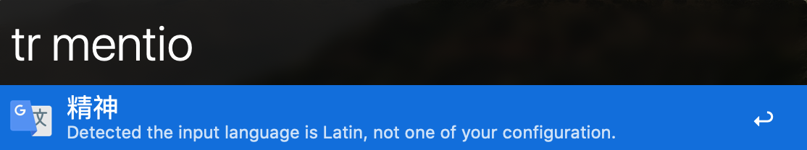

# alfred-google-translate

### JetBrains' support

## Installation

*Requires the Alfred 3 or 4 [Powerpack](https://www.alfredapp.com/powerpack/), [Node.js](https://nodejs.org) 8+, and the [alfred-language-configuration](https://github.com/xfslove/alfred-language-configuration) workflow.*

To use this workflow you must also install the [alfred-language-configuration](https://github.com/xfslove/alfred-language-configuration) workflow, and configure the language pair. See that [README](https://github.com/xfslove/alfred-language-configuration) for instructions.

### With NPM
- Install with `npm install -g alfred-google-translate`.

### Manually
- Or [download the workflow directly](https://github.com/xfslove/alfred-google-translate/releases/tag/v2.0.8).

## Changelog
See [all past and current releases](https://github.com/xfslove/alfred-google-translate/releases).

## Usage

Alfred workflow Keyword: `tr [word or sentence]`
Example: `tr kitchen sink` or `tr Hello, my name is Alfred`

When translating a word you will see the translation as well as alternate translations if available.

With the first two results (which are the input word and the translation) you can…
- press <kbd>enter</kbd> to read the item.
- press <kbd>cmd</kbd>+<kbd>C</kbd> to copy the item.
- press <kbd>shift</kbd> open the translate website.
- press <kbd>cmd</kbd>+<kbd>L</kbd> to show the translation in large text.

The workflow will attempt to correct spelling mistakes which can be accepted with <kbd>enter</kbd>.

## Environment Variables

| name       | default value                | description                                                  |
| ---------- | ---------------------------- | ------------------------------------------------------------ |
| domain     | https://translate.google.com | if you cannot access the default domain, you can config this.  大陆访问不了默认域名，所以如果使用2.x版本需要将这个变量设置为https://translate.google.cn. 或者还是使用[1.x版本](https://github.com/xfslove/alfred-google-translate/tree/v1.x) |
| voice      | remote                       | avaliable values:  remote: fetch voice from google,  local: use macOS local voice (notice: maybe only works on English), none: dont use voice |
| save_count | 20                           | limit the translation history, see [alfred-translate-history](https://github.com/xfslove/alfred-translate-history).   a value of 0 will keep no history |

##### environment variables config snapshot:

## Hotkey

If you download the workflow, you may have to manually set the hotkey yourself.

##### hotkey config snapshot:

##### hotkey and largetype snapshot:

## Screenshots

  

  

- press <kbd>enter</kbd> to read or <kbd>cmd</kbd>+<kbd>C</kbd> to copy

    

- press <kbd>shift</kbd> to open the translation website

    

- press <kbd>cmd</kbd>+<kbd>L</kbd> to show the translation in large text [like this](#hotkey-and-largetype-snapshot).

## Related

- [alfy](https://github.com/sindresorhus/alfy) - Create Alfred workflows with ease
- [google-translate-api](https://github.com/vitalets/google-translate-api) - A free and unlimited API for Google Translate

## License

MIT © 
